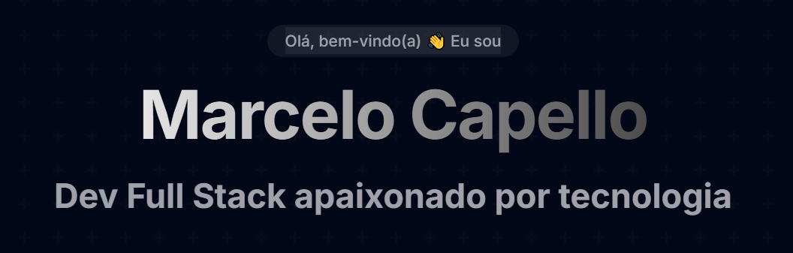

# Portfólio - Marcelo Capello



## 🚀 Sobre o Projeto

Este é o meu portfólio profissional, desenvolvido para apresentar minhas habilidades, projetos e fornecer uma visão clara do meu perfil como desenvolvedor Full Stack.

O site foi construído com React e possui design responsivo, animações fluidas e uma experiência de usuário intuitiva. Utiliza tecnologias modernas como Tailwind CSS e Framer Motion para criar uma interface atraente e interativa.

## 🛠️ Tecnologias Utilizadas

- **React** - Biblioteca JavaScript para construção de interfaces
- **Tailwind CSS** - Framework CSS utilitário para estilização rápida e responsiva
- **Framer Motion** - Biblioteca para animações fluidas e interativas
- **Shadcn/UI** - Componentes React de alta qualidade e acessíveis
- **React Icons** - Biblioteca de ícones para React
- **Lucide React** - Conjunto de ícones limpos e consistentes
- **Sonner** - Sistema de notificações toast moderno e minimalista

## ✨ Funcionalidades

- **Design Responsivo** - Adaptação perfeita para dispositivos móveis, tablets e desktops
- **Tema Claro/Escuro** - Suporte a preferências de tema do usuário
- **Animações Interativas** - Experiência visual envolvente com animações sutis
- **Carrossel Infinito** - Exibição dinâmica de tecnologias e habilidades
- **Seção de Projetos** - Apresentação visualmente atraente dos projetos desenvolvidos
- **Formulário de Contato** - Canal direto de comunicação
- **CV para Download** - Disponibilização do currículo para download

## 🚀 Como Executar o Projeto

```bash
# Clone este repositório
git clone https://github.com/MBCapello/portfolio.git

# Acesse a pasta do projeto
cd portfolio

# Instale as dependências
npm install

# Execute a aplicação em modo de desenvolvimento
npm run dev

# O servidor inciará na porta 5173 - acesse http://localhost:5173
```

## 📝 Implementações Futuras

- Integração com API do GitHub para exibição automática de repositórios
- Blog para compartilhamento de artigos técnicos
- Seção de depoimentos/recomendações
- Métricas de projetos e contribuições
- Mapa interativo para visualização de experiências
- Tema personalizado com mais opções de cores

## 📬 Contato

- **Email**: mbcapello@gmail.com
- **LinkedIn**: [linkedin.com/in/seu-perfil](https://linkedin.com/in/seu-perfil)
- **GitHub**: [github.com/MBCapello](https://github.com/MBCapello)
- **WhatsApp**: [(21) 98096-9725](https://wa.me/5521980969725)

## 📄 Licença

Este projeto está sob a licença MIT. Veja o arquivo [LICENSE](LICENSE) para mais detalhes.

---

Desenvolvido com ☕ e 💻 por Marcelo Capello
